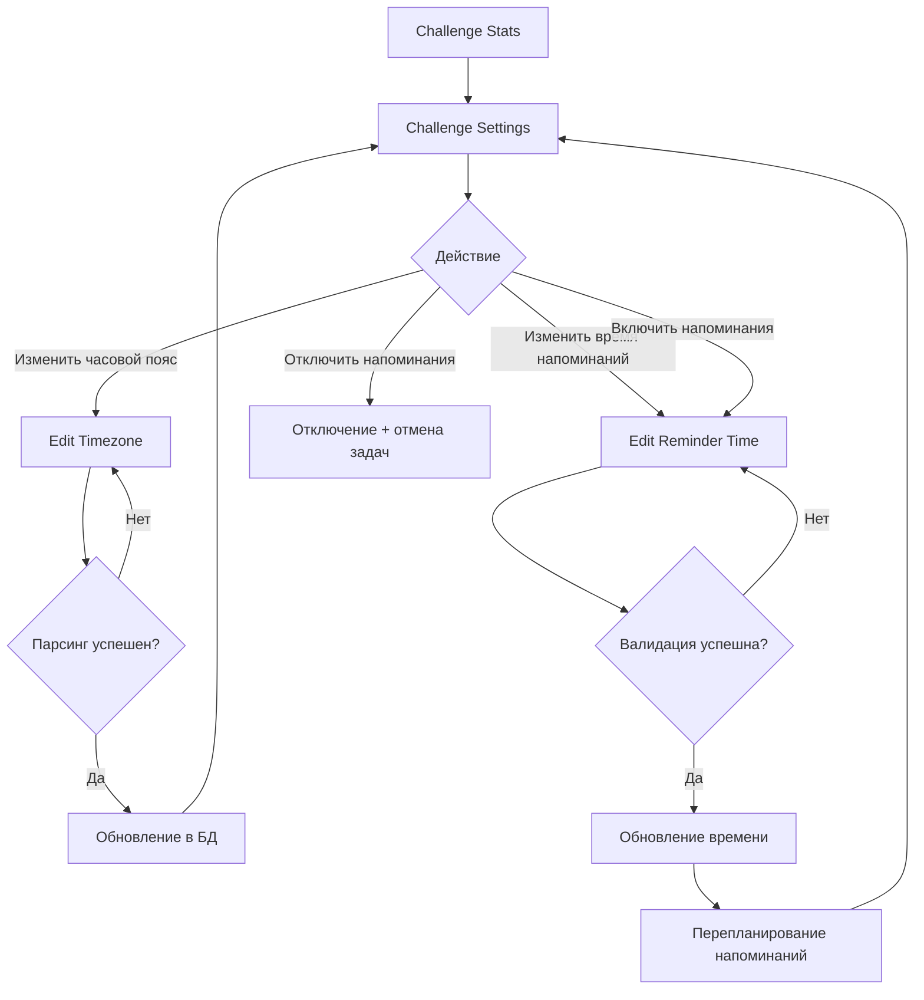
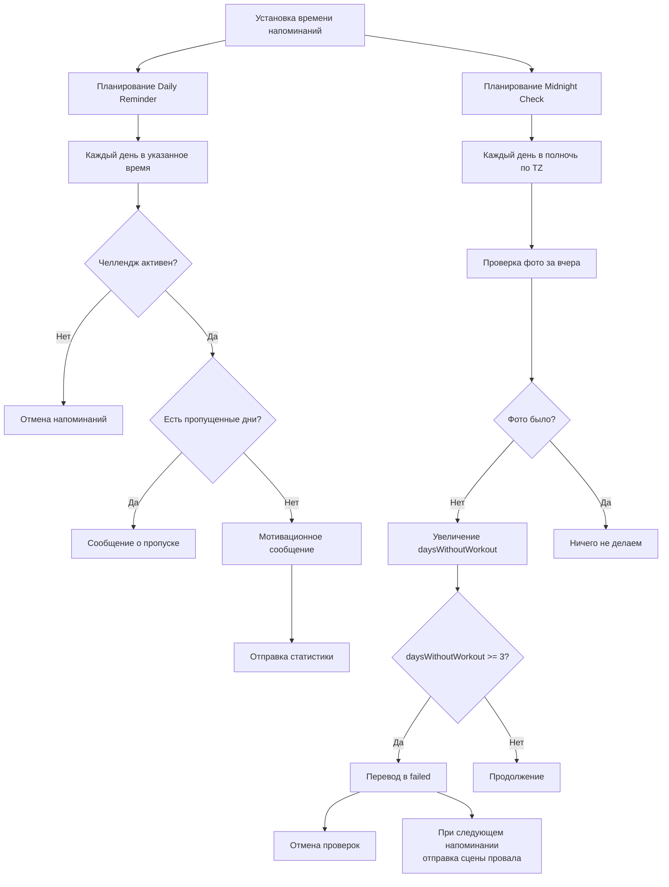
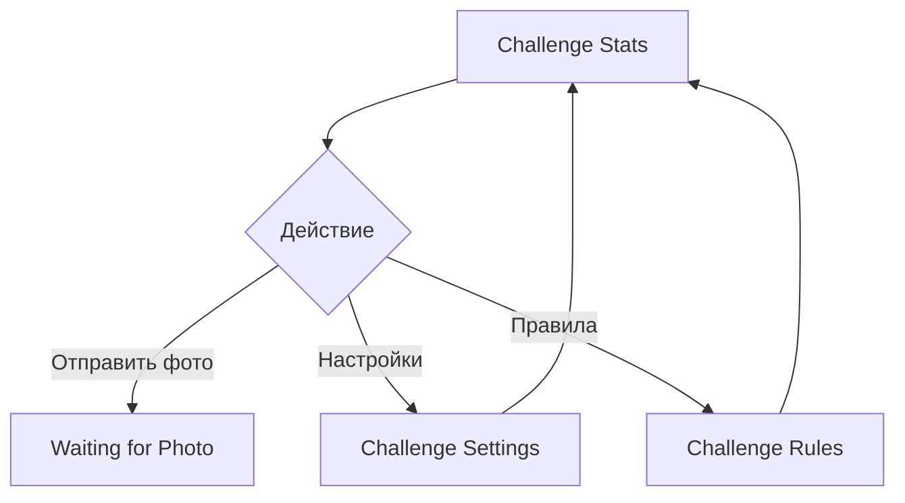
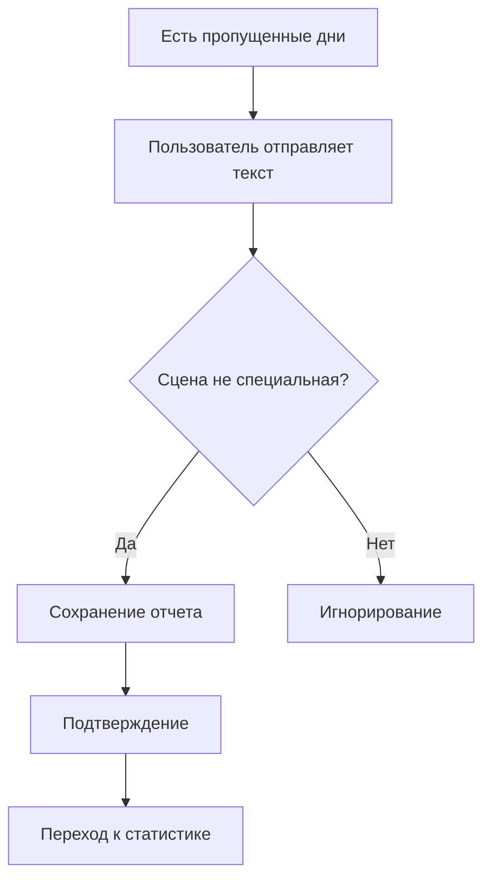

# Карта пользовательских сценариев Motivation Bot

## Обзор системы

Telegram-бот для мотивационного челленджа "Жиробой" - помогает пользователям вести ежедневные тренировки/активности с загрузкой фото.

---

## Основные пользовательские потоки

### 1. 🚀 Создание нового челленджа

```mermaid
graph TD
    A[/start] --> B{Есть активный<br/>челлендж?}
    B -->|Да| C[Старт с кнопкой<br/>"К челленджу"]
    B -->|Нет| D[Старт с кнопками<br/>"Инфо" / "Начать"]
    D --> E[Begin: Выбор времени старта]
    E --> F{Когда начинаем?}
    F -->|Сегодня| G[Duration: Выбор<br/>30/60/90 дней]
    F -->|Завтра| H[Tomorrow: Сообщение<br/>+ планирование на завтра]
    F -->|Понедельник| I[Monday: Сообщение<br/>+ планирование на понедельник]
    H --> J[Уведомление завтра<br/>в 12:00 МСК]
    I --> K[Уведомление в понедельник<br/>в 12:00 МСК]
    J --> G
    K --> G
    G --> L[Создание челленджа в БД]
    L --> M{Успешно?}
    M -->|Ошибка: уже есть| N[Сообщение об ошибке<br/>+ переход к статистике]
    M -->|Успешно| O[Timezone: Ввод часового пояса]
    O --> P{Парсинг успешен?}
    P -->|Нет| O
    P -->|Да| Q[Reminder Time: Ввод времени]
    Q --> R{Валидация успешна?}
    R -->|Нет| Q
    R -->|Да| S[Challenge Rules: Показ правил]
    S --> T[Challenge Stats: Главный экран]
```

**Проблемные области:**
- ⚠️ **Нет валидации часового пояса при создании** - пользователь может ввести неверный формат и застрять
- ⚠️ **Нет возможности пропустить настройку часового пояса** - обязательный шаг
- ⚠️ **При ошибке создания челленджа (уже есть активный)** - пользователь видит ошибку, но может быть неочевидно, что делать дальше

---

### 2. 📸 Загрузка фото тренировки

```mermaid
graph TD
    A[Challenge Stats] --> B[Кнопка "Отправить фото"]
    B --> C[Waiting for Photo]
    C --> D{Пользователь отправил}
    D -->|Текст| E[Возврат к статистике]
    D -->|Фото| F{Проверки}
    F -->|Нет активного челленджа| G[Ошибка: нет челленджа]
    F -->|Челлендж не active| H[Ошибка: завершен]
    F -->|Фото уже загружено сегодня| I[Сообщение: уже загружено]
    F -->|Все ОК| J[Обработка фото]
    J --> K[Увеличение successfulDays]
    K --> L[Обнуление daysWithoutWorkout]
    L --> M[Отправка обработанного фото]
    M --> N[Возврат к статистике]
```

**Проблемные области:**
- ⚠️ **Нет проверки размера файла** - может быть проблема с большими фото
- ⚠️ **Обработка фото может упасть** - только общая ошибка, нет деталей
- ⚠️ **Если пользователь отправил фото не нажав кнопку** - получает сообщение, но может быть неочевидно
- ⚠️ **Нет проверки формата фото** - может быть проблема с не-изображениями

---

### 3. ⚙️ Настройки челленджа



**Проблемные области:**
- ⚠️ **Нет проверки, что часовой пояс установлен перед включением напоминаний** - может быть ошибка
- ⚠️ **При изменении времени напоминаний** - если часовой пояс не установлен, может быть проблема

---

### 4. 🔔 Система напоминаний и проверок



**Проблемные области:**
- 🔴 **КРИТИЧНО: Восстановление задач при рестарте** - если бот перезапустился, задачи могут быть потеряны
- ⚠️ **Race condition между midnight check и daily reminder** - если оба сработают одновременно
- ⚠️ **Нет обработки ошибок при отправке напоминаний** - если пользователь заблокировал бота
- ⚠️ **TTL в Redis может истечь** - задачи могут быть потеряны
- ⚠️ **Нет механизма восстановления пропущенных проверок** - если бот был недоступен

---

### 5. 📊 Просмотр статистики



**Проблемные области:**
- ⚠️ **Если челлендж не найден** - только сообщение, нет кнопки "Начать новый"
- ⚠️ **Нет информации о прогрессе** - только числа, нет визуализации

---

### 6. ❌ Провал челленджа

```mermaid
graph TD
    A[3 дня без фото] --> B[Midnight Check обнаруживает]
    B --> C[Перевод в failed]
    C --> D[Отмена проверок]
    D --> E[При следующем напоминании]
    E --> F[Challenge Failed Scene]
    F --> G[Кнопка "Начать новый"]
    G --> A
```

**Проблемные области:**
- ⚠️ **Пользователь узнает о провале только при следующем напоминании** - может быть задержка
- ⚠️ **Нет возможности восстановить челлендж** - только начало нового

---

### 7. 📝 Отчет о пропущенной тренировке



**Проблемные области:**
- ⚠️ **Нет явного способа отправить отчет** - только отправка текста
- ⚠️ **Нет валидации отчета** - может быть пустой текст
- ⚠️ **Нет возможности просмотреть/редактировать отчеты**

---

## 🔴 Критические проблемные области

### 1. **Восстановление состояния при рестарте**
- **Проблема**: Задачи в памяти теряются при рестарте бота
- **Текущее решение**: Есть `restoreTasks()`, но:
  - Может быть race condition при параллельных вызовах
  - TTL в Redis может истечь
  - Нет гарантии, что все задачи восстановятся
- **Риск**: Пользователи могут не получить напоминания или проверки

### 2. **Обработка ошибок при отправке сообщений**
- **Проблема**: Если пользователь заблокировал бота, ошибки не обрабатываются
- **Текущее решение**: Только логирование
- **Риск**: Задачи продолжают планироваться для заблокированных пользователей

### 3. **Race conditions в scheduler**
- **Проблема**: `scheduleDailyReminder` и `scheduleMidnightCheck` могут конфликтовать
- **Текущее решение**: Нет синхронизации
- **Риск**: Дублирование задач или потеря данных

### 4. **Валидация входных данных**
- **Проблема**: Недостаточная валидация:
  - Часовой пояс: только парсинг, нет проверки диапазона (-12 до +14)
  - Время: только формат, нет проверки разумности
  - Фото: нет проверки размера/формата
- **Риск**: Некорректные данные в системе

### 5. **Состояние машины состояний**
- **Проблема**: Восстановление состояния через последовательность событий может быть неточным
- **Текущее решение**: Сложная логика восстановления в `state.service.ts`
- **Риск**: Пользователь может оказаться в неправильной сцене

### 6. **Обработка ошибок Telegram API**
- **Проблема**: Нет обработки специфичных ошибок Telegram API (403 Forbidden при блокировке, 429 Rate Limit)
- **Текущее решение**: Только общее логирование ошибок
- **Риск**: Задачи продолжают планироваться для заблокированных пользователей, нет обработки rate limits

### 7. **Обработка изображений**
- **Проблема**: 
  - Нет проверки размера файла (может быть проблема с большими фото)
  - Нет проверки формата (может быть не-изображение)
  - Ошибка обработки может привести к потере данных
- **Текущее решение**: Только try-catch с логированием
- **Риск**: Пользователь может потерять загруженное фото при ошибке обработки

### 8. **Незавершенный функционал**
- **Проблема**: В `messages.ts:34` есть TODO для текста заповедей
- **Риск**: Пользователь видит незавершенный текст

---

## ⚠️ Средние проблемные области

### 9. **UX проблемы**
- Нет возможности пропустить настройку часового пояса
- Нет явной кнопки для отправки отчета
- При ошибках нет понятных инструкций
- Нет визуализации прогресса

### 10. **Производительность**
- Каждый запрос проверяет состояние в Redis
- Нет кеширования активных челленджей
- Множественные запросы к БД в одном flow

### 11. **Мониторинг и логирование**
- Нет метрик успешности операций
- Нет алертов на критические ошибки
- Логирование есть, но нет структурированных метрик

---

## ✅ Рекомендации по улучшению

### Приоритет 1 (Критично)
1. **Улучшить восстановление задач**
   - Использовать транзакции Redis
   - Добавить механизм проверки целостности
   - Реализовать retry логику

2. **Обработка ошибок Telegram API**
   - Обрабатывать ошибки блокировки бота
   - Отменять задачи для заблокированных пользователей
   - Логировать и мониторить такие случаи

3. **Синхронизация в scheduler**
   - Использовать блокировки Redis
   - Предотвращать дублирование задач

### Приоритет 2 (Важно)
4. **Улучшить валидацию**
   - Добавить проверку диапазонов
   - Валидация размера/формата фото
   - Более понятные сообщения об ошибках

5. **Улучшить UX**
   - Возможность пропустить настройку часового пояса
   - Явные кнопки для всех действий
   - Визуализация прогресса

6. **Оптимизация производительности**
   - Кеширование активных челленджей
   - Batch операции где возможно
   - Оптимизация запросов к БД

### Приоритет 3 (Желательно)
7. **Мониторинг**
   - Метрики успешности операций
   - Алерты на критические ошибки
   - Dashboard для мониторинга

8. **Дополнительные функции**
   - Просмотр истории отчетов
   - Экспорт статистики
   - Социальные функции (шаринг прогресса)

---

## 📋 Матрица рисков

| Проблема | Вероятность | Влияние | Приоритет |
|----------|-------------|---------|-----------|
| Потеря задач при рестарте | Высокая | Критическое | P0 |
| Ошибки при отправке (блокировка) | Средняя | Высокое | P0 |
| Race conditions в scheduler | Средняя | Высокое | P0 |
| Недостаточная валидация | Высокая | Среднее | P1 |
| Неточное восстановление состояния | Средняя | Среднее | P1 |
| Плохой UX | Высокая | Среднее | P2 |
| Производительность | Низкая | Среднее | P2 |

---

## 🔍 Детальный анализ проблемных участков кода

### 1. `scheduler.service.ts:61-118` - restoreTasks()
```typescript
// Проблема: isRestoring флаг не защищает от всех race conditions
// Решение: Использовать Redis lock
```

### 2. `scheduler.service.ts:684-700` - scheduleDailyReminderInternal()
```typescript
// Проблема: Нет обработки ошибок при отправке
// Решение: Обрабатывать Telegram API ошибки
```

### 3. `middleware.ts:317-396` - Обработка фото
```typescript
// Проблема: Нет проверки размера/формата
// Решение: Добавить валидацию перед обработкой
```

### 4. `state.service.ts:26-86` - Восстановление состояния
```typescript
// Проблема: Сложная логика восстановления через события
// Решение: Сохранять полное состояние машины
```

### 5. `challenge.service.ts:214-256` - checkAndIncrementMissedDays()
```typescript
// Проблема: Нет транзакций, возможны race conditions
// Решение: Использовать транзакции БД
```

### 6. `scheduler.service.ts:684-700` - sendDailyReminder()
```typescript
// Проблема: Нет обработки ошибок Telegram API (403, 429)
// Решение: Обрабатывать специфичные ошибки и отменять задачи
```

### 7. `middleware.ts:364-395` - Обработка фото
```typescript
// Проблема: Нет проверки размера/формата перед обработкой
// Решение: Валидация перед вызовом processImage
```

### 8. `image-processor.ts:11-109` - processImage()
```typescript
// Проблема: Нет ограничения размера входного изображения
// Решение: Добавить проверку размера и сжатие при необходимости
```

### 9. `state.service.ts:26-86` - Восстановление состояния
```typescript
// Проблема: Сложная логика восстановления через события
// Решение: Сохранять полное состояние машины или использовать более простой подход
```

---

## 📊 Статистика проблем

- **Критических проблем**: 8
- **Средних проблем**: 3
- **Всего проблемных участков кода**: 9
- **Незавершенный функционал**: 1 (TODO в messages.ts)

---

## 🎯 План действий (Roadmap)

### Неделя 1 (Критично)
1. ✅ Добавить обработку ошибок Telegram API (403, 429)
2. ✅ Улучшить восстановление задач с Redis locks
3. ✅ Добавить транзакции в checkAndIncrementMissedDays

### Неделя 2 (Важно)
4. ✅ Валидация размера/формата фото
5. ✅ Улучшить обработку ошибок при отправке сообщений
6. ✅ Добавить проверку блокировки пользователя

### Неделя 3 (Улучшения)
7. ✅ Оптимизация производительности (кеширование)
8. ✅ Улучшение UX (кнопки, сообщения)
9. ✅ Завершить TODO в messages.ts

---

*Документ создан: 2024*
*Версия: 1.1*
*Последнее обновление: Детальный анализ всех компонентов системы*
