# Визуализация пользовательских сценариев Motivation Bot

## 📊 Общая диаграмма состояний (State Machine)

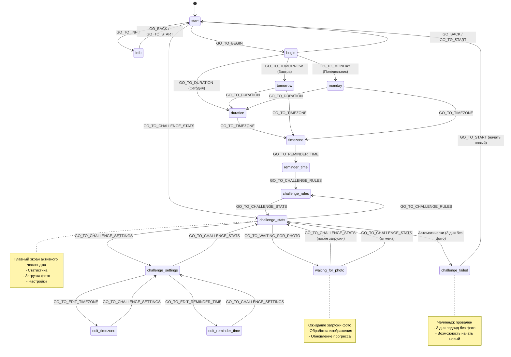

---

## 🎯 Основные пользовательские сценарии

### Сценарий 1: Создание нового челленджа (Новый пользователь)

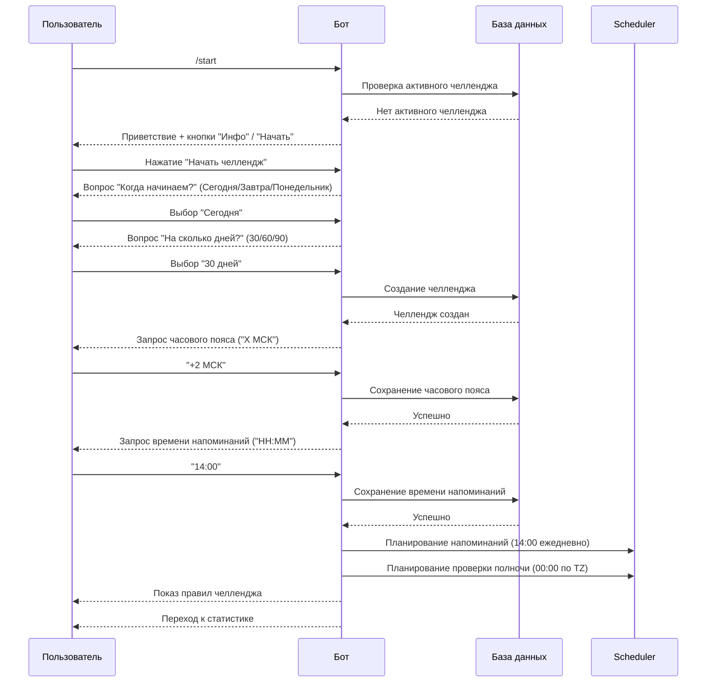

---

### Сценарий 2: Загрузка фото тренировки

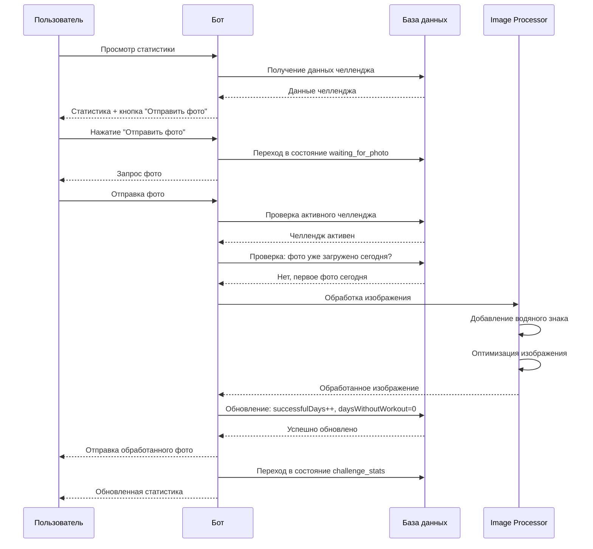

---

### Сценарий 3: Ежедневный цикл напоминаний и проверок

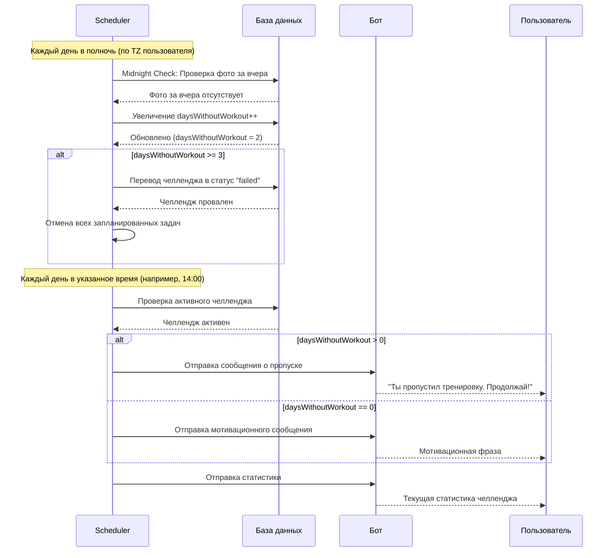

---

### Сценарий 4: Настройки челленджа

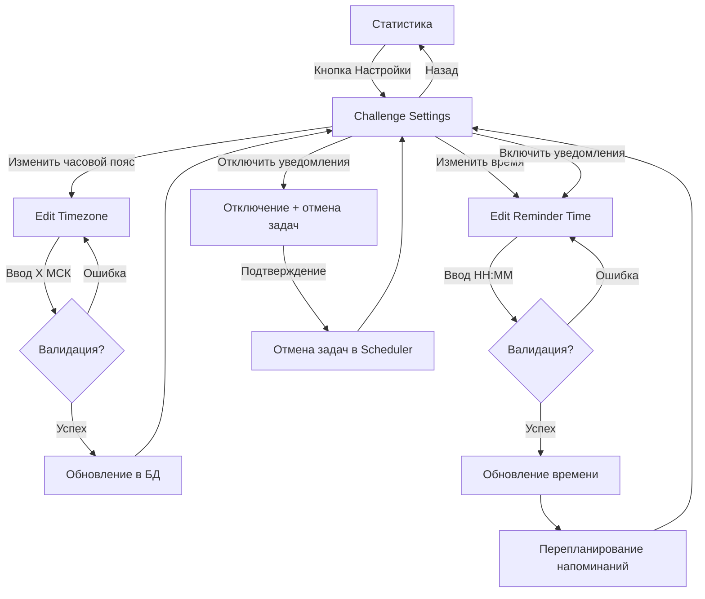

---

### Сценарий 5: Провал челленджа

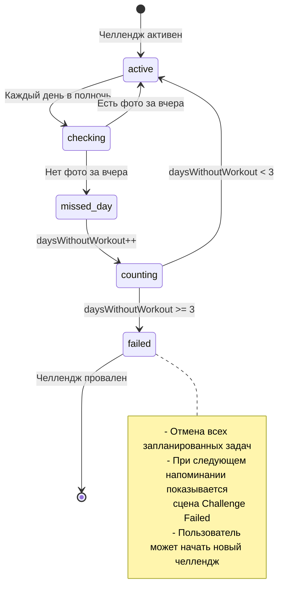

---

### Сценарий 6: Пользователь с активным челленджем

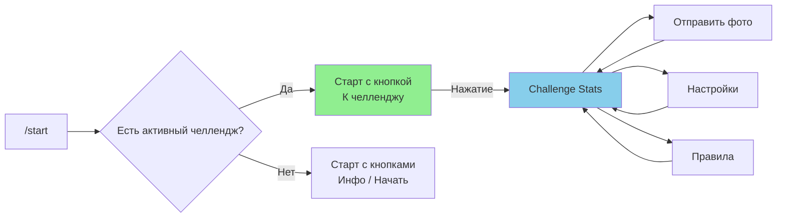

---

## 🔄 Полный поток взаимодействия пользователя

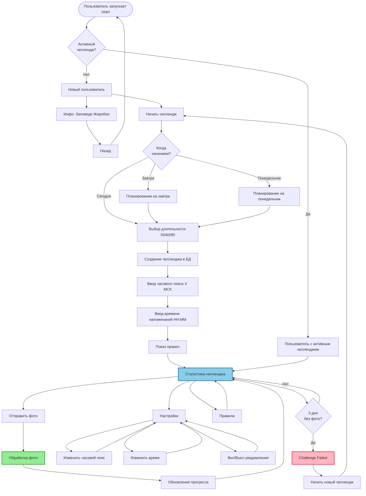

---

## 📱 Детализация сцен и их переходы

### Главные экраны

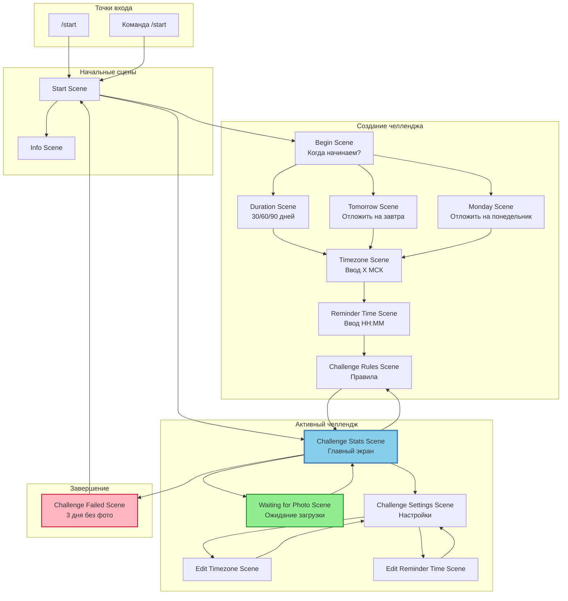

---

## ⏰ Временные процессы (Scheduler)

### Ежедневные проверки и напоминания

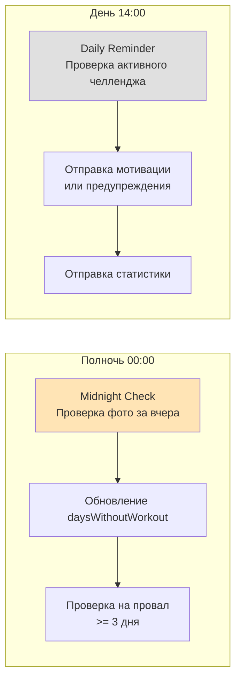

### Диаграмма временных процессов

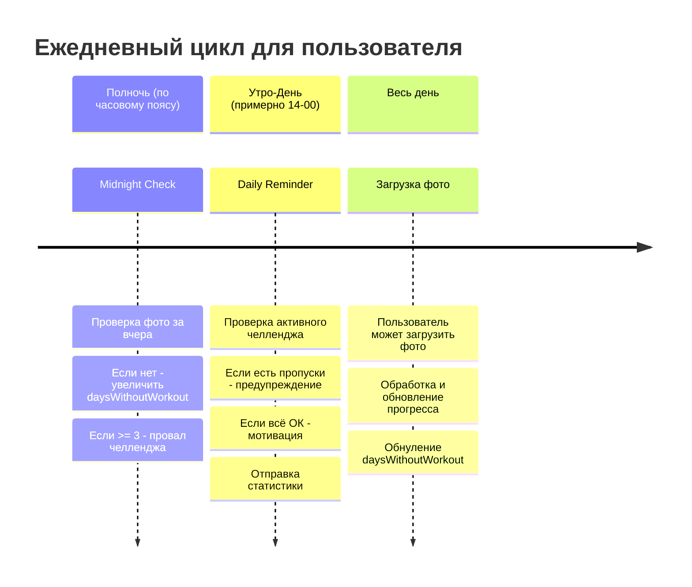

---

## 🎬 Последовательность событий: Полный жизненный цикл челленджа

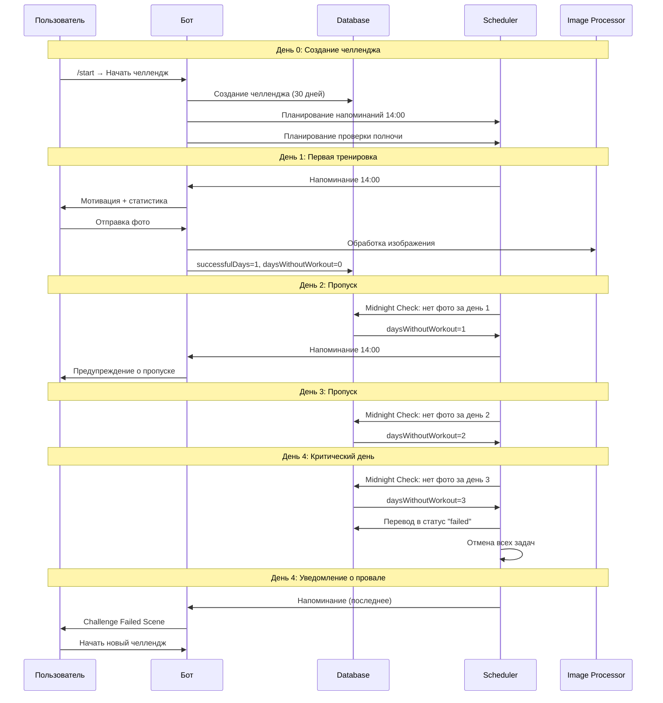

---

## 📊 Матрица переходов между сценами

| Из сцены | В сцену | Условие/Действие |
|----------|---------|------------------|
| start | info | Нажатие "Инфо" |
| start | begin | Нажатие "Начать челлендж" |
| start | challenge_stats | Есть активный челлендж |
| begin | duration | Выбор "Сегодня" |
| begin | tomorrow | Выбор "Завтра" |
| begin | monday | Выбор "Понедельник" |
| duration | timezone | Выбор длительности (30/60/90) |
| timezone | reminder_time | Ввод часового пояса |
| reminder_time | challenge_rules | Ввод времени напоминаний |
| challenge_rules | challenge_stats | Просмотр правил |
| challenge_stats | waiting_for_photo | Нажатие "Отправить фото" |
| challenge_stats | challenge_settings | Нажатие "Настройки" |
| challenge_stats | challenge_rules | Нажатие "Правила" |
| challenge_stats | challenge_failed | Автоматически (3 дня без фото) |
| waiting_for_photo | challenge_stats | После загрузки фото или отмена |
| challenge_settings | edit_timezone | Нажатие "Изменить часовой пояс" |
| challenge_settings | edit_reminder_time | Нажатие "Изменить время" |
| edit_timezone | challenge_settings | После ввода часового пояса |
| edit_reminder_time | challenge_settings | После ввода времени |
| challenge_failed | start | Нажатие "Начать новый" |

---

## 🎯 Ключевые точки взаимодействия

### 1. Точка входа (/start)
- **Действие**: Команда `/start`
- **Логика**: Проверка наличия активного челленджа
- **Переходы**: 
  - Нет челленджа → кнопки "Инфо" / "Начать"
  - Есть челлендж → кнопка "К челленджу"

### 2. Главный экран (challenge_stats)
- **Функции**: 
  - Просмотр статистики
  - Загрузка фото
  - Настройки
  - Просмотр правил
- **Обновления**: После каждой загрузки фото

### 3. Точка обработки фото (waiting_for_photo)
- **Валидация**: 
  - Есть активный челлендж
  - Фото не загружено сегодня
  - Формат изображения
- **Действия**: 
  - Обработка изображения
  - Обновление прогресса
  - Обнуление пропусков

### 4. Точка провала (challenge_failed)
- **Условие**: 3 дня подряд без фото
- **Действия**: 
  - Отмена всех запланированных задач
  - Показ экрана провала
  - Возможность начать новый челлендж

---

*Документ создан для визуализации всех пользовательских сценариев в проекте Motivation Bot*
*Версия: 1.0*
*Последнее обновление: 2024*
